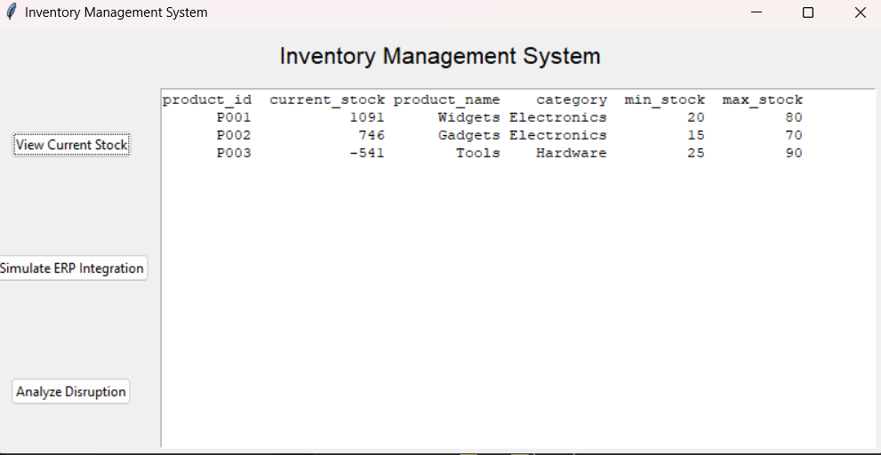
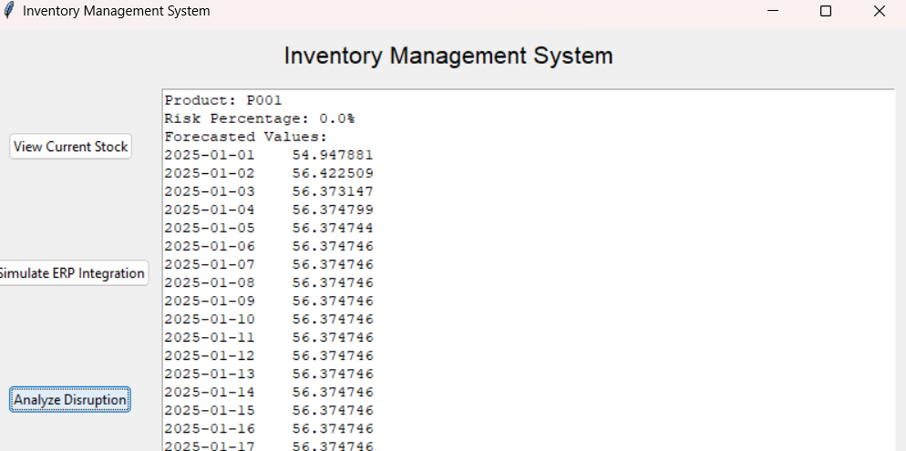
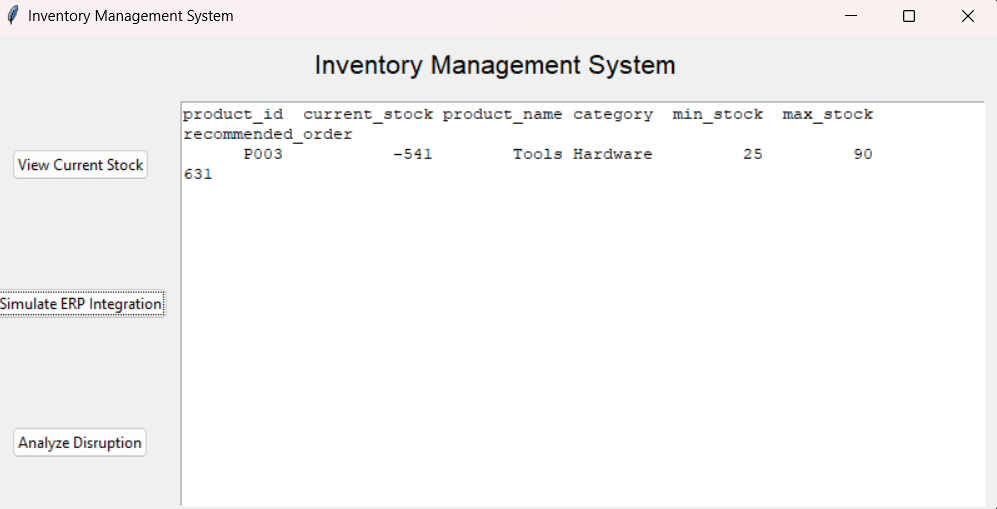

# Milestone 3: AI-Driven Supply Chain Optimization

This milestone involves implementing an advanced **Inventory Management System** that integrates predictive disruption modeling and ERP simulation using Python. The solution includes a graphical user interface (GUI) built with Tkinter, and logging functionality to save the results for analysis.

---

## Features

1. **Predictive Disruption Modeling System**:
   - Uses ARIMA to forecast potential inventory disruptions.
   - Computes risk scores for maintaining minimum stock levels.
   - Displays forecasted inventory levels and risk analysis.

2. **ERP Integration and Inventory Adjustment**:
   - Simulates ERP integration to recommend stock adjustments.
   - Identifies understocked products and provides reorder recommendations.

3. **GUI Built with Tkinter**:
   - User-friendly interface with the following features:
     - View Current Stock Levels.
     - Simulate ERP Integration.
     - Analyze Disruption Risk.

4. **Logging**:
   - Saves ERP integration results and disruption analysis in log files for review.

---

## File Details

- **Code File**: `Milestone_3.py`
- **Log Files**:
  - `ERP_Integration.log`
  - `Disruption_Modeling.log`

---

## Repository Structure

```
AI_driven_supply_chain/
└── Milestone_3/
    ├── Milestone_3.py
    ├── README.md
    ├── screenshots/
    │   ├── screenshot1.png
    │   ├── screenshot2.png
    │   └── screenshot3.png
    ├── ERP_Integration.log
    └── Disruption_Modeling.log
```

---

## Screenshots

### 1. Main Menu


### 2. Current Stock View


### 3. Disruption Analysis Results


---

## How to Run

1. **Clone the Repository**:
   ```bash
   git clone https://github.com/GauriGandhi200517/AI_driven_supply_chain.git
   cd AI_driven_supply_chain/Milestone_3
   ```

2. **Install Dependencies**:
   ```bash
   pip install pandas numpy statsmodels matplotlib
   ```

3. **Run the Program**:
   ```bash
   python Milestone_3.py
   ```

4. **Interact with the GUI**:
   - Select options to view stock, simulate ERP integration, or analyze disruptions.

---

## Acknowledgments

This project demonstrates advanced supply chain optimization techniques by leveraging predictive analytics and automation principles.

