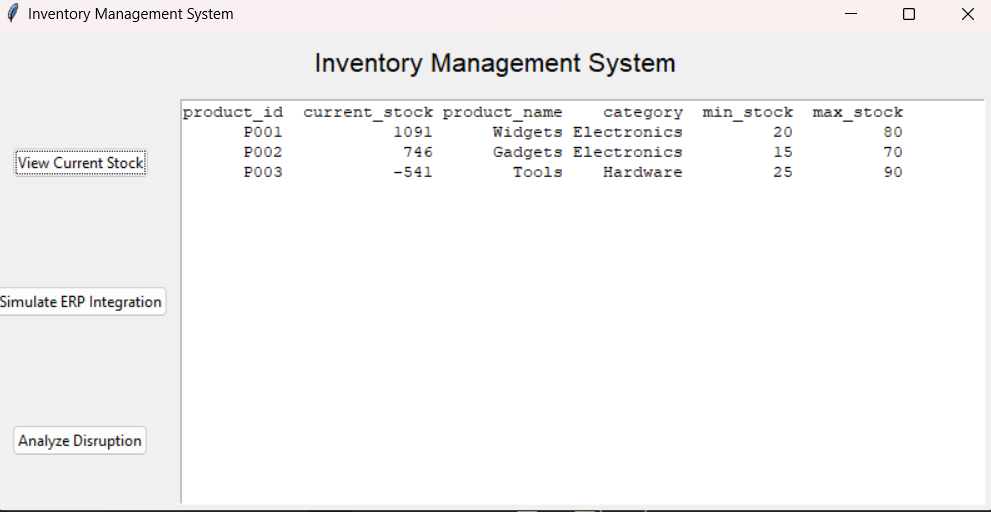
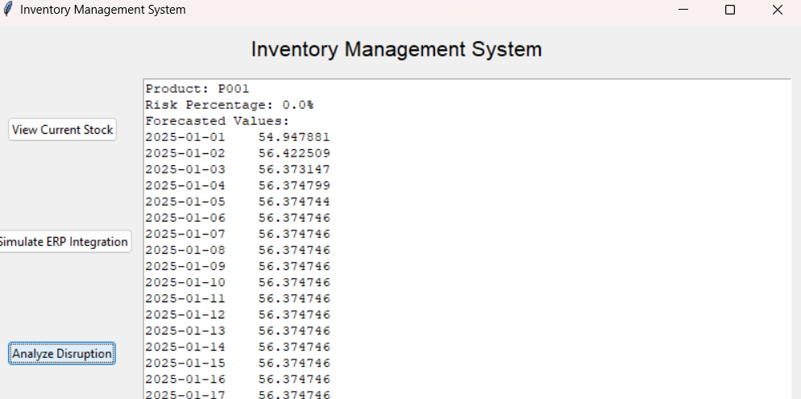
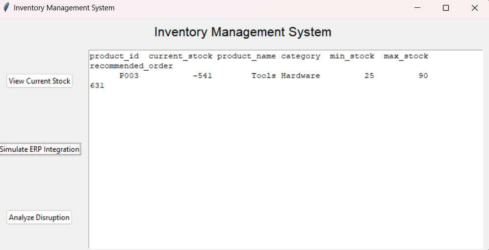

---

# Milestone 4: AI-Driven Supply Chain Management

This project is part of the AI-Driven Supply Chain Management system. The core focus is on inventory management, disruption analysis, and ERP integration. This milestone involves implementing a Tkinter-based graphical user interface (GUI) that helps visualize and interact with inventory data, disruptions, and ERP recommendations.

## Features

1. **Inventory Management System**  
   - View current stock levels for various products.
   
2. **ERP Integration Simulation**  
   - Simulate ERP integration to recommend stock adjustments for understocked products.

3. **Disruption Analysis**  
   - Forecast inventory disruptions using ARIMA, and analyze the risk of stock shortages.

4. **Real-Time Alert and Reporting Dashboard**  
   - Instant notifications are generated via Slack or email for critical disruption predictions and inventory recommendations (future enhancement).
   
5. **Comprehensive Visualizations**  
   - Detailed visual representations of supply chain risks and current inventory status (future enhancement).

## Requirements

- Python 3.x
- Libraries:
  - `pandas`
  - `numpy`
  - `datetime`
  - `statsmodels`
  - `tkinter`
  - `logging`
  - `matplotlib` (for visualizations, not implemented yet)
  
You can install the required libraries using `pip`:

```bash
pip install pandas numpy statsmodels matplotlib
```

## Functionality

1. **Current Stock Calculation**  
   This functionality calculates the current stock levels for each product by processing inventory transactions such as `in` and `out`.

2. **ERP Integration Simulation**  
   The system recommends orders to restock products that are below their minimum stock level.

3. **Disruption Analysis**  
   This feature uses ARIMA forecasting to predict potential disruptions in inventory levels and assess the risk of stockouts.

## Tkinter GUI Screenshots

### 1. **Main Dashboard**  
The main screen displays buttons to interact with the system, including options to view current stock, simulate ERP integration, and analyze disruption.



### 2. **Current Stock View**  
Shows the current stock levels for each product.



### 3. **Disruption Analysis View**  
Displays the forecast and risk percentage for potential disruptions in inventory.



## Future Enhancements

- **Real-Time Alert System**  
   Instant notifications via Slack or Email to alert users about critical disruptions or stock shortages.
   
- **Visualizations**  
   Graphical representation of inventory levels, disruption forecasts, and supply chain risks.

## How to Run

1. Clone the repository:

```bash
git clone https://github.com/GauriGandhi200517/AI_driven_supply_chain.git
```

2. Navigate to the Milestone_4 directory:

```bash
cd AI_driven_supply_chain/Milestone_4
```

3. Run the script:

```bash
python Milestone_4.py
```

This will launch the Tkinter GUI where you can interact with the system.
---
